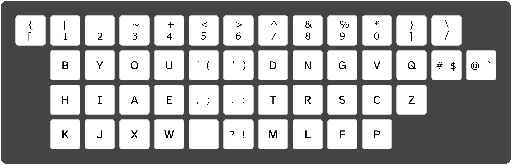
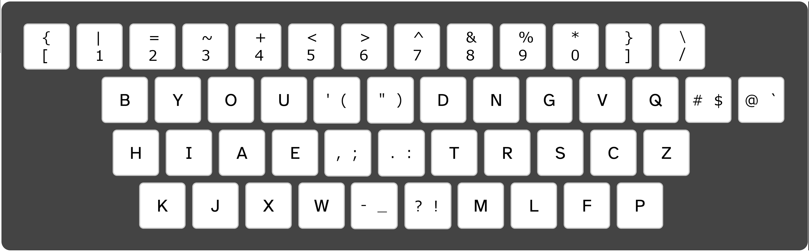

# Engram-en optimized keyboard layout for English
Engram-en is a keyboard layout optimized for comfortable and efficient touch typing in English created by [Arno Klein](https://arnoklein.info) as part of a [family of Engram layouts](https://engram-layouts.xyz) ([GitHub](https://github.com/binarybottle/engram)).

[Try out](https://keyman.com/keyboards/engram_en) Engram-en online and install it on Windows, macOS, and Linux.

A manuscript has been accepted for publication in the International Journal of Human-Computer Interaction that describes the Engram approach to optimizing keyboard layouts for different languages. The approach is based on language-dependent n-gram frequencies and language-independent typing preferences, using multi-objective optimization informed by crowdsourced typing data. Letters are optimally arranged according to ergonomics factors that promote reduction of lateral finger movements and more efficient typing of high-frequency letter pairs. The most common punctuation marks are logically grouped together in the middle columns and numbers are paired with mathematical and logic symbols.

**"Ergonomic" orthonormal keyboard**

**Staggered/diagonal keyboard**

         [{ 1| 2= 3~ 4+  5<  6>  7^ 8& 9% 0* ]} /\
            bB yY oO uU  '(  ")  dD nN gG vV qQ #$ @`
            hH iI aA eE  ,;  .:  tT rR sS cC zZ 
            kK jJ xX wW  -_  ?!  mM lL fF pP
