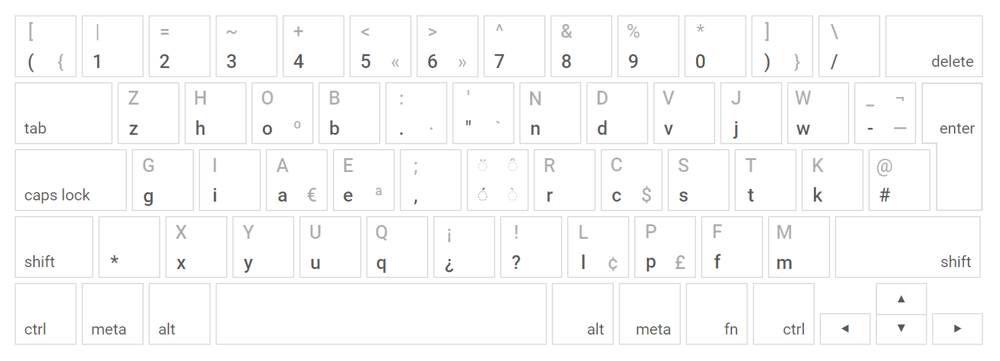

# Engram-es Spanish keyboard layout
Engram-es is a keyboard layout optimized for comfortable and efficient touch typing in English created by [Arno Klein](https://arnoklein.info).

An article is currently under review that describes the Engram approach to optimizing keyboard layouts, including development of the Engram-es layout, and you can use the [open-source software](https://github.com/binarybottle/optimize-layouts) to create new key layouts optimized for different languages.

The Engram approach is based on language-dependent n-gram frequencies and language-independent typing preferences, using multi-objective optimization informed by crowdsourced typing data. Letters are optimally arranged according to ergonomics factors that promote reduction of lateral finger movements and more efficient typing of high-frequency letter pairs. The most common punctuation marks and special key for diacritical marks (☆) are logically grouped together in the middle columns and numbers are paired with mathematical and logic symbols (shown as pairs of default and Shift-key-accessed characters). See below for a full description.

          [ | = ~ +   <  >   ^ & % * ] \
          ( 1 2 3 4   5  6   7 8 9 0 ) /

            Z H O X  .:  "'  M D B J W -_ #@
            P I E A  ,;  ☆   T S N R K
            F Y Q U  ¿¡  ?!  C L V G
            
    ☆ + aeiouAEIOU = áéíóúÁÉÍÓÚ (acute accent)
    ☆ + nN = ñÑ
    ☆ + cC = çÇ
    ☆ + Shift         + [letter] = [letter] with a diaresis/umlaut: ü
    ☆         + AltGr + [letter] = [letter] with a grave accent: è
    ☆ + Shift + AltGr + [letter] = [letter] with a circumflex: â
    AltGr + ( = { (open curly brace)
    AltGr + ) = } (close curly brace)
    AltGr + 5 = « (open quote/comillas) 
    AltGr + 6 = » (close quote/comillas)
    AltGr + - = — (em dash)
    AltGr + ' = ` (back tick)
    AltGr + . = • (middle dot, or "interpunct")
    AltGr + s = $ (dollar currency)
    AltGr + e = € (euro currency)
    AltGr + l = £ (pound currency)

### Layout (default, Shift, and AltGr layers)

